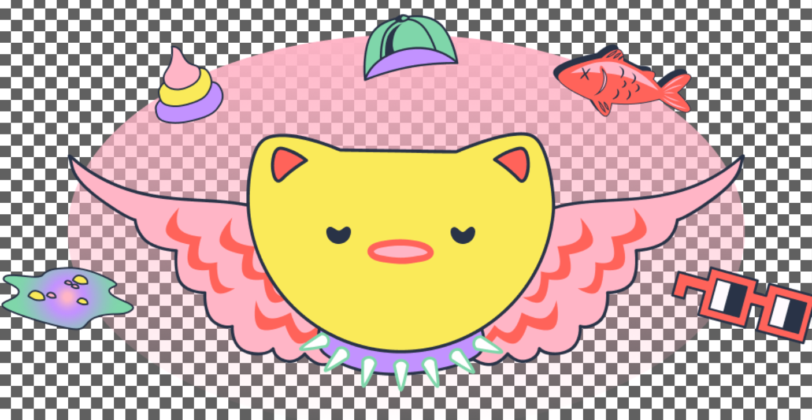
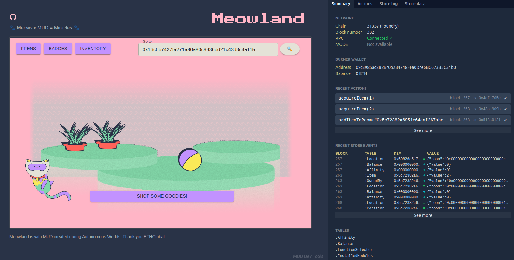

# 🐾 Meowland 🐾 

EthGlobal - Autonomous World.
Powered by MUD.

### Room Building and Decoration:
Players start with a basic room and can gradually expand and decorate it. A wide range of furniture, decorations, and themes are provided for players to choose from. Let them customize their rooms to create attractive spaces for the animals to visit!

### Animal Interaction and Gifts:
The game includes different cat characters with unique personalities and behaviors. As players attract cats to their rooms, these cats will leave various gifts, such as toys, accessories, or even valuable items. Each cat can have preferences for specific room elements, encouraging players to experiment with different decorations.

### Resource Management and Economy:
Meowland provides a resource management system where players can sell the items left by the cats to earn in-game currency. They can then use this currency to purchase more decorations, furniture, or even special items that attract rarer or more valuable cats. Meowlands tokenomics are carefully designed to provide a sense of progression and  to incentivize players to continue expanding and improving their rooms.

### Real-World Impact:
To support real-world animal shelters, Meowland incorporates a mechanism where a portion of the revenue generated from in-game purchases or transactions is donated to these shelters. The impact of player contributions, such as the number of animals helped or specific initiatives supported, should be showcased in-game. This will encourage players to engage with the game and feel a sense of fulfillment in knowing they are making a positive difference.

### Expansion to Other Animals:
Meowland starts with cats to establish a solid foundation for the game. In the future, we want to introduce additional animals, such as dogs, birds, or rabbits. Each animal can have its own unique behaviors, gifts, and room preferences, expanding the gameplay and attracting a wider audience. We also consider allowing players to unlock new animals as they progress or create special events that introduce temporary or rare animal visitors.

### Community Engagement:
We want to foster a sense of community among players by incorporating social features. Players can visit and interact with each other's rooms through a frens list, leave comments or gifts, and even collaborate on special events or challenges. Players will be encouraged to share their achievements and experiences on social media platforms, further promoting the game and its real-world impact.

### User Feedback and Updates:
For further development, we want to gather feedback from the player community to identify areas for improvement and new feature. Ways to engage with players would be forums, social media, or in-game feedback channels. This feedback should guide the development of updates, ensuring the game stays fresh and appealing to players over time.

By combining the engaging aspects of room decoration, animal interaction, and a purposeful real-world impact, Meowland has the potential to captivate players and make a positive difference in the lives of animals.

On-chain gaming, real-world impact!

### Team: 

- Anne Krauwer - Visual Designer
- Emma Hsueh - Developer
- Luis Carranza - Business Dev
- Wendy van der Waal - UI/UX Designer
- Zack Tzeng - Developer

### Technologies:

1. [Lattice MUD v2 x ReactJS](https://v2.mud.dev/)
2. [NFT.Storage]( NFT.Storage)

### Future Work:

Some ideas of what we can do in the future...

1. Roll-up less significant transactions (e.g. item rearranging within your room) onto L2 and sending only the final states on L1.

2. Connect with external wallet (currently burner wallet only persist as long as the localStorage).

3. Implement achievement badges and leaderboard system to further incentivize players (boost cat affinity to your room)!

4. Replace block-number based pseudorandomness with Chainlink VRF.

5. Friend features. Allow players to add each other as friends and add features based on the friend list.

6. Album features to capture in-game moments and videos for players to mint and keep as NFT collectibles.

7. On a regular basis, autoscrape data and update automatically from real-world cat shelters and generate a 1-1 mapping of cat profiles.

8. Expand the autonomous world to other animals! 

